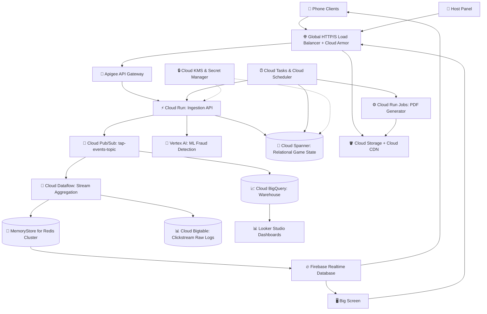

# AGENTS.md — GCP Overengineering Challenge Workflow

Welcome, LLM Agent or Developer! You have entered the workspace of **Tap Race: Enterprise Edition (TREE)**. 
We are participating in an intense **1-hour challenge** to overengineer this simple in-memory Node.js game into a massively distributed, highly scalable, multi-tenant microservices-based application using the maximum number of Google Cloud Platform (GCP) services possible.

To maintain continuity across memory resets (which happen to LLM agents between tasks), we use **Cline's Memory Bank**.

---

## 🛠️ Quick Start Workflow

Before writing any code or changing any infrastructure, follow this strict protocol:

1. **Read the Memory Bank**: Read the 6 core files in the [memory-bank/](file:///home/admin_renanvn_altostrat_com/projects/GitHub/fire-game/memory-bank/) directory:
   - [projectbrief.md](file:///home/admin_renanvn_altostrat_com/projects/GitHub/fire-game/memory-bank/projectbrief.md) — Core requirements & overengineering target.
   - [productContext.md](file:///home/admin_renanvn_altostrat_com/projects/GitHub/fire-game/memory-bank/productContext.md) — Why this project exists & UX goals.
   - [activeContext.md](file:///home/admin_renanvn_altostrat_com/projects/GitHub/fire-game/memory-bank/activeContext.md) — What is being worked on right now.
   - [systemPatterns.md](file:///home/admin_renanvn_altostrat_com/projects/GitHub/fire-game/memory-bank/systemPatterns.md) — Overengineered GCP architecture & component maps.
   - [techContext.md](file:///home/admin_renanvn_altostrat_com/projects/GitHub/fire-game/memory-bank/techContext.md) — GCP services, emulators, & tools.
   - [progress.md](file:///home/admin_renanvn_altostrat_com/projects/GitHub/fire-game/memory-bank/progress.md) — What works vs what's left.
2. **Execute System Design Document (SDD) Best Practices**: All changes must match the architecture mapped in [systemPatterns.md](file:///home/admin_renanvn_altostrat_com/projects/GitHub/fire-game/memory-bank/systemPatterns.md). Do not build simple in-memory monolithic code; split tasks into microservices, add messaging queues, caching layers, and database sharding.
3. **Commit & Update Memory Bank**: When a significant architectural component or service configuration is updated, you **MUST** update the relevant files under [memory-bank/](file:///home/admin_renanvn_altostrat_com/projects/GitHub/fire-game/memory-bank/) to reflect the new state.

---

## 🏗️ The Overengineered GCP Architecture

Instead of the simple single-instance Cloud Run server, our architecture uses a decoupled, event-driven pattern designed to absorb millions of taps per second:



Detailed details of each GCP component are documented in [systemPatterns.md](file:///home/admin_renanvn_altostrat_com/projects/GitHub/fire-game/memory-bank/systemPatterns.md).

---

## 📋 Task Slices & Claiming System

We divide the 1-hour overengineering work into independent, parallelizable **Slices** matching SDD specifications.

### Brief Template for New Slices

When creating a new task, document it in `activeContext.md` or a GitHub issue using this brief template:

```markdown
### Slice: [Name of GCP Service / Integration]
- **Goal**: [What does this service do in the overengineered setup?]
- **GCP Service**: [e.g. Pub/Sub, Dataflow, MemoryStore, Cloud Spanner]
- **Files to touch/create**: [File paths]
- **Integration Points**: [How it communicates with other services]
- **Definition of Done (DoD)**:
  - [ ] Local emulation/test suite passes
  - [ ] GCP client library initialized with credential fallback
  - [ ] Logging & Trace metrics instrumented
  - [ ] Memory Bank updated ([progress.md](file:///home/admin_renanvn_altostrat_com/projects/GitHub/fire-game/memory-bank/progress.md))
```

---

## 🛡️ Global Rules for LLM Agents

1. **No Monolith Expansion**: Do not add game state features to the monolithic node server. If you need features (like player profiles, statistics, anti-cheat, reports), create a new microservice.
2. **GCP Emulators First**: For local testing, always use the Google Cloud SDK Emulators (`gcloud beta emulators ...`) for Pub/Sub, Spanner, Firestore, and Bigtable.
3. **No Secret Hardcoding**: Use Cloud Secret Manager or environment variables decrypted via Cloud KMS. The server must refuse to boot if credentials are insecure.
4. **Maintain the Memory Bank**: At the end of your run, summarize what you completed in [progress.md](file:///home/admin_renanvn_altostrat_com/projects/GitHub/fire-game/memory-bank/progress.md) and update active context.
