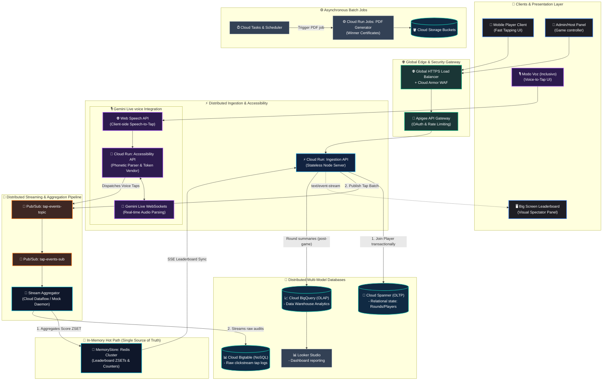

# 🌴 Tap Race: Enterprise Edition (TREE) — System Architecture

Welcome to the official system architecture catalog for **Tap Race: Enterprise Edition (TREE)**. 

To absorb massive load spikes (thousands of players tapping concurrently during live events), this system has been overengineered from a single-instance monolithic app into a decoupled, event-driven, multi-tenant microservices-based distributed architecture deployed on **Google Cloud Platform (GCP)**.

---

## 🗺️ High-Fidelity System Map

This diagram illustrates the end-to-end data flow, ingestion queues, databases, streaming analytics, telemetry exporters, and our specialized **Gemini Live Voice-to-Tap Accessibility Subsystem**.



---

## 🛠️ Detailed Architectural Breakdown

### 1. Ingestion & Core API Layer (`Cloud Run`)
* **Technology**: Node.js, Express, Docker.
* **Service Model**: Deployed as a single CPU, hot-pinned container (`min-instances 1` to prevent multiple split-brain memory counters) capable of high concurrency (`concurrency 1000`) and unthrottled performance.
* **Role**:
  * **Lobby & Ingress**: Handles initial player sign-ups (`/join`) and administrative tasks (`/admin/*`).
  * **High-Concurrency Streamer**: Serves long-lived SSE connections (`/state`) to public display screens.

### 2. 🎙️ Gemini Live Voice-to-Tap Accessibility Subsystem
TREE implements an inclusive gameplay model allowing players to interact via speech rather than mechanical tapping. This is powered by two parallel pipelines:
* **Client-side Speech Analysis (`Web Speech API`)**:
  * Captures live microphone feeds directly in the player's browser.
  * Analyzes phonetic syllabic rhythm (e.g., repeating *"pa-ta-pa-ta"*).
  * Automatically converts spoken syllables into mock tap counts and streams them instantly to the ingestion layer.
* **Cloud Run Audio Parser (`src/accessibility/server.js`)**:
  * Vendors temporary access tokens for secure AI interaction.
  * Establishes low-latency, bidirectional WebSocket connections to the **Gemini Live API**.
  * Performs high-fidelity voice-tap stream translation, converting speech cues to gameplay input and pushing events onto our global queue.

### 3. Buffering & Streaming Pipeline (`Pub/Sub` & `Dataflow`)
To absorb spikes (e.g., 300+ users tapping 5-10 times per second simultaneously), we decouple HTTP endpoints from the databases:
* **Cloud Pub/Sub**: Taps are immediately published to `tap-events-topic`. This provides sub-millisecond, durable buffering.
* **Cloud Dataflow (Mock / stream-processor)**: A high-velocity, real-time subscriber reading from `tap-events-sub`. It processes clickstreams, increments metrics, and updates data sinks.

### 4. Stateful & Memory Layer (`Memorystore Redis`)
* **Technology**: Google Cloud Memorystore (Redis v7).
* **Network**: Connected directly to Google Cloud Run via **Direct VPC Egress** (`dev-vpc` network, `dev-subnet` subnet).
* **Role**: Single source of truth for all live gameplay stats:
  * **Sorted Sets (ZSET)**: Keeps instantaneous leaderboards (`round:X:scores`) ordered by score with millisecond read/write latencies.
  * **Global Counters**: Aggregates the absolute tap metrics (`round:X:totalTaps`) of the ongoing match.

### 5. Multi-Model Distributed Databases
* **Cloud Spanner (OLTP Relational)**: Holds persistent game configurations, historical profiles, and strict transactional metadata (such as active state changes: `lobby` ➡️ `countdown` ➡️ `running` ➡️ `ended`). Guaranteed serializable isolation.
* **Cloud Bigtable (OLAP clickstream logging)**: Receives a continuous stream of raw ingestion logs directly from the pipeline. Highly performant NoSQL columnar structure designed to scale infinitely.
* **Cloud BigQuery (Analytics Warehouse)**: Finalized round summary metrics are written directly to BQ datasets (`round_summaries`) for historical aggregation, export, and BI reporting in **Looker Studio**.

### 6. Background Automation & Certifications
* **Cloud Tasks / Scheduler**: Triggers asynchronous cron loops for round intervals and anti-cheat evaluations.
* **Winner Certificate Cloud Run Job**: On round closure, a high-resolution certificate generator is triggered, compiling dynamic victory PDFs (featuring player metadata and final metrics) and saving them securely to GCS buckets (`tree-victory-certificates`).

---

## 📈 Operational Health Checks & Verification

To verify that the microservices and routing paths are healthy:

1. **Verify Redis & DB Connectivity:**
   Ensure the active round transitions successfully without any socket failures or authorization issues.
2. **Ping Server Status:**
   ```bash
   curl -X GET https://tap-race-843525441473.us-central1.run.app/state
   ```
3. **Execute Live Match Transitions:**
   Trigger the start schema with your dedicated admin token:
   ```bash
   curl -X POST -H "Content-Type: application/json" -d '{"token": "supersecret", "durationMs": 30000}' https://tap-race-843525441473.us-central1.run.app/admin/start
   ```
